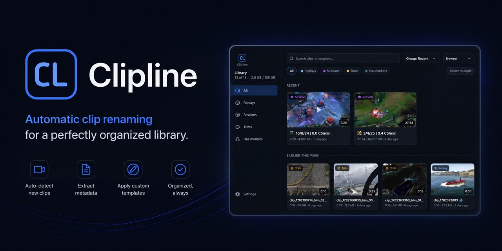

<div align="center">



Lightweight, local-first game recording for Windows.

[Docs](https://dain98.github.io/clipline-docs/) ·
[Download nightly](https://github.com/dain98/clipline/releases) ·
[Report an issue](https://github.com/dain98/clipline/issues/new/choose)

</div>

Clipline is an open-source desktop recorder for saving gameplay replays, full-session recordings, and reviewable clips without ads, accounts, telemetry, watermarks, or game injection.

It uses Windows.Graphics.Capture for no-injection capture, hardware encoders where available, local game APIs for timeline markers, and a built-in review player for scrubbing and lossless trim.

## Start Here

The maintained user and developer docs live at [dain98.github.io/clipline-docs](https://dain98.github.io/clipline-docs/).

- [Install Clipline](https://dain98.github.io/clipline-docs/desktop/install)
- [First run](https://dain98.github.io/clipline-docs/desktop/first-run)
- [Recording](https://dain98.github.io/clipline-docs/desktop/recording)
- [Review and trim](https://dain98.github.io/clipline-docs/desktop/review-and-trim)
- [Cloud uploads](https://dain98.github.io/clipline-docs/desktop/cloud-uploads)
- [Troubleshooting](https://dain98.github.io/clipline-docs/reference/troubleshooting)
- [Diagnostic logs and private bug reports](docs/TROUBLESHOOTING.md)
- [Privacy and diagnostic data](docs/PRIVACY.md)

## Status

Clipline is nightly, testing-grade Windows software. Expect rough edges, and please file issues with your Windows version, GPU, encoder, game, capture mode, and logs when something misbehaves.

The installer is not Authenticode code-signed yet, so Windows SmartScreen may warn on first run. The updater bundle itself is signed. See the [install docs](https://dain98.github.io/clipline-docs/desktop/install) for the practical details.

## Development

```powershell
git clone https://github.com/dain98/clipline.git
cd clipline
cargo run -p clipline-app
```

Useful checks:

```powershell
cargo test --workspace
cargo clippy --workspace --all-targets -- -D warnings
```

More developer notes are in the [local development docs](https://dain98.github.io/clipline-docs/developers/local-development). The repo's design and handoff files are still here:

- [ddoc.md](ddoc.md)
- [handoff.md](handoff.md)
- [docs/superpowers/plans](docs/superpowers/plans)

## Contributing

Issues and PRs are welcome. Keep changes small, test-first where practical, and aligned with the existing Rust workspace and Tauri app structure.

## License

Clipline's first-party code is dual-licensed under MIT OR Apache-2.0. FFmpeg is used as a separate LGPL process for some encode paths. See [THIRD-PARTY-NOTICES.md](THIRD-PARTY-NOTICES.md).
