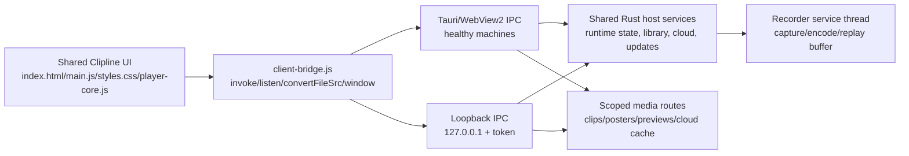

# WebView2-Free Fallback Client Design

## Context

Clipline's current desktop client is a Tauri 2 application whose UI runs in
Microsoft Edge WebView2. The normal installer now uses Tauri's small embedded
Evergreen bootstrapper and the app shows a native repair notice when WebView2 is
missing or broken. That path helps most Windows 10 users, but it does not help a
machine where the user has intentionally removed Edge/WebView2 and will not keep
the runtime installed.

The affected machine still needs Clipline to work as the same product, not as a
reduced emergency recorder. The fallback client therefore needs full feature
parity with the WebView2 client: recorder control, settings, capture-region
editing, custom game detection, local and cloud libraries, review playback,
timeline markers, trim/export, rename/delete/share, cloud upload, update checks,
hotkeys, tray behavior, and native file/clipboard actions.

The existing UI is already large and feature-rich. `apps/clipline-app/ui/main.js`
currently calls 41 Tauri commands and listens to 8 event streams. Rebuilding all
of that in a separate native GUI would create two clients that can drift. The
fallback should instead make the existing UI host-agnostic.

## Goals

- Clipline launches a fully functional fallback client when WebView2 is missing,
  unusable, or never becomes ready.
- The fallback client has feature parity with the current WebView2 client.
- The existing HTML/CSS/JavaScript UI remains the single source of truth for the
  product interface.
- The WebView2 client and fallback client share the same command names, request
  shapes, response shapes, event names, and media URL conversion API.
- Full parity is enforced by automated contract tests so new WebView features
  cannot ship without fallback support.
- The fallback is local-only and safe: no remote network surface, no broad file
  serving, no raw filesystem paths exposed as browser-readable URLs.
- Existing recorder, hotkey, tray, cloud, update, library, and settings behavior
  keep working in the normal Tauri client.

## Non-Goals

- Do not require Nate or any other user to reinstall WebView2.
- Do not replace the Tauri/WebView2 client for healthy machines.
- Do not build a second native Rust GUI with separate feature implementations.
- Do not weaken path validation or expose arbitrary local files over HTTP.
- Do not make the fallback cloud-only or browser-extension-dependent.
- Do not claim compatibility with machines that have no usable default browser.
  The fallback assumes the user has at least one regular browser installed.

## Recommended Approach

Build a local loopback browser fallback that reuses Clipline's existing UI files.
When WebView2 is healthy, the UI runs exactly as it does today through Tauri IPC.
When WebView2 is unavailable, Clipline starts a localhost server, opens the
system default browser to a tokenized loopback URL, and the same UI talks to the
same Rust backend through HTTP command calls plus a live event stream.

The essential change is a small host bridge:

- `client-bridge.js` exposes `invoke`, `listen`, `convertFileSrc`, and window
  helpers.
- In Tauri mode it delegates to `window.__TAURI__`.
- In fallback mode it calls the loopback server on `127.0.0.1` and subscribes to
  server-sent events or a WebSocket.
- `main.js` imports or reads the bridge instead of reading `window.__TAURI__`
  directly.

This keeps one interface and one interaction model. The fallback is not a
separate product; it is a second host for the same Clipline client.

## Architecture

### Shared UI

The files under `apps/clipline-app/ui/` remain the source of truth. The fallback
serves these files from the installed app bundle or the development checkout. UI
code should use only the bridge API for backend calls and local media URLs.

`main.js` must stop destructuring directly from `window.__TAURI__` at startup.
The bridge should be loaded before `main.js` and provide:

- `cliplineHost.invoke(command, args)`
- `cliplineHost.listen(event, handler)`
- `cliplineHost.convertFileSrc(path)`
- `cliplineHost.window.minimize()`
- `cliplineHost.window.toggleMaximize()`
- `cliplineHost.window.close()`
- `cliplineHost.mode`, with values such as `tauri` and `fallback`

Window helpers are no-ops or browser-safe fallbacks where the browser cannot
offer native control. For example, fallback `minimize` can request the host to
hide/minimize the hidden native coordinator window if one exists, while browser
maximize remains a browser window concern.

### Shared Host Services

Today the Tauri command handlers are split across `app.rs`, `library.rs`, and
`cloud.rs`, with some Tauri types embedded in signatures. The implementation
should extract a client-neutral control layer that can be called from both Tauri
commands and loopback HTTP handlers.

The shared layer owns:

- `RuntimeState` access and recorder start/stop/save requests.
- Settings load/save and restart preparation.
- Display/audio/device/game/window/encoder probes.
- Library listing, posters, delete, rename, export, reveal, copy, and storage
  status.
- Cloud status, connection, profile/avatar, cloud library, thumbnail/cache,
  sync, URL open, and upload.
- Update check/install semantics.
- Mic test start/stop and sample event emission.
- Event fanout to every active client host.

Tauri-specific wrappers should become thin adapters. Loopback handlers should
call the same functions.

### Startup Detection

The fallback must load when WebView2 does not exist or cannot create a working
frontend. Startup should use both preflight and health signals:

- Keep the existing registry diagnostics for WebView2 runtime `pv` values.
- Add a direct WebView2 availability decision that can run before opening the
  main UI. Missing registry/runtime state should be enough to prefer fallback.
- Keep the existing post-reveal getter probe and frontend-ready watchdog.
- If WebView creation fails, getter probes report `FailedToReceiveMessage`, or
  the frontend-ready watchdog expires, start the fallback server and open the
  fallback URL.
- Ensure the fallback opens only once per process unless the user explicitly
  requests reopening it from the tray.

The existing native repair dialog should change role. If fallback startup
succeeds, show no repair-only dead end. If fallback startup fails, then show a
native diagnostic explaining that WebView2 is unavailable and the browser
fallback could not start, with the diagnostic log path.

### Loopback Server

The server binds only to loopback, preferably `127.0.0.1` on an OS-assigned
port. Every fallback URL contains a random per-process token. Requests without
the token are rejected.

Endpoints:

- `GET /<token>/` serves `index.html`.
- `GET /<token>/ui/<asset>` serves bundled UI assets.
- `POST /<token>/invoke/<command>` accepts JSON args and returns the same JSON
  result or string error shape the bridge exposes to `main.js`.
- `GET /<token>/events` streams named events using SSE or WebSocket.
- `GET /<token>/media/<id>` streams a validated MP4, poster PNG, audio preview,
  or cached cloud media item.
- `POST /<token>/window/<action>` handles browser-host requests such as close,
  minimize, or reopen, where applicable.

Use a small Rust HTTP stack that is compatible with the current Windows-only app
crate. If adding a dependency, prefer permissively licensed crates and keep them
Windows-gated with the Tauri app dependencies.

### Transport Contract

The fallback transport must cover every current frontend command:

- `cache_cloud_clip_media`
- `check_for_updates`
- `choose_media_folder`
- `choose_replay_cache_folder`
- `clip_poster`
- `cloud_clip_thumbnail`
- `cloud_connect`
- `cloud_disconnect`
- `cloud_user_avatar`
- `cloud_user_profile`
- `copy_clip_to_clipboard`
- `delete_clip`
- `export_clip`
- `extract_window_icon`
- `frontend_ready`
- `get_autostart_status`
- `get_settings`
- `install_update`
- `list_audio_devices`
- `list_clips`
- `list_cloud_clips`
- `list_displays`
- `list_game_plugins`
- `list_game_windows`
- `memory_status`
- `minimize_main_window`
- `open_cloud_clip_url`
- `open_cloud_user_profile`
- `preview_clip_audio_tracks`
- `probe_encoders`
- `rename_clip`
- `report_decode_support`
- `reveal_clip`
- `save_replay`
- `save_settings`
- `set_recording`
- `start_microphone_test`
- `stop_microphone_test`
- `storage_status`
- `sync_cloud_clip_status`
- `upload_clip_to_cloud`

The fallback event stream must cover every current frontend listener:

- `cloud-upload-progress`
- `error`
- `game-detection`
- `mic-test`
- `mic-test-error`
- `mic-test-stopped`
- `saved`
- `status`

Automated tests should derive these command and event names from `main.js` and
assert that both the Tauri handler registry and fallback route registry cover
them.

### Media URLs

The fallback must implement a `convertFileSrc` equivalent. It must never return
raw `file://` URLs for arbitrary paths.

The server should issue opaque media IDs for validated paths and stream them
through `/media/<id>`. Validation must mirror the current Tauri asset-protocol
rules:

- Local clips must pass `library::validate_clip_path`.
- Poster paths must be produced by the poster cache for a validated clip.
- Audio previews must live under the audio preview cache and end in `.mp4`.
- Cached cloud media and thumbnails must live under the cloud cache path the
  cloud module already validates before scoping assets.
- Range requests must be supported for MP4 playback and seeking.
- Media IDs should expire when the process exits and may be pruned in memory
  when the underlying file disappears.

### Native Capability Parity

The fallback host must provide equivalents for the native behaviors currently
provided by Tauri plugins or direct Windows APIs:

- Tray icon/menu: Open Clipline, Save Replay, Quit.
- Save Replay hotkey: existing low-level hook remains active; Tauri global
  shortcut registration should be optional in fallback mode.
- Autostart: keep the existing release-build Run-key behavior or extract an
  equivalent Windows implementation.
- Folder pickers: continue using `rfd::FileDialog` from the host for media and
  replay-cache folder selection.
- Explorer reveal/open folder: keep the current `explorer.exe` path.
- File clipboard: keep the current CF_HDROP implementation.
- Cloud URL open: keep the current `ShellExecuteW` path.
- Updates: fallback `check_for_updates` and `install_update` must preserve the
  Tauri updater behavior or move update metadata/download/install into a shared
  implementation. It is not acceptable for fallback mode to lose updater
  support.
- Mic test: host continues to capture samples and streams `mic-test` events;
  browser playback uses the existing Web Audio path in `main.js`.

### Security

The loopback server is a privileged local control surface. Its security model is
part of the feature, not an afterthought.

- Bind only to loopback.
- Use a cryptographically random per-process token in every URL.
- Reject requests without the token.
- Use POST for commands that mutate state.
- Validate command names against a static registry.
- Validate JSON payloads with typed request structs.
- Keep all filesystem operations behind existing path validators.
- Add CORS headers only for the exact fallback origin, or avoid CORS entirely by
  serving the UI and API from the same tokenized origin.
- Do not log credentials, cloud tokens, or full upload passwords.
- Rotate diagnostic logs as today.

### Error Handling

Fallback startup should be visible and diagnosable:

- Log why fallback was selected: missing runtime, WebView build failure, getter
  failure, or readiness timeout.
- If default-browser launch fails, log the fallback URL path without exposing the
  token in broad logs, and show a native dialog with a copyable local URL only if
  necessary.
- If a fallback command fails, the bridge should reject the `invoke` promise with
  the same string-style error the WebView UI expects.
- If the event stream disconnects, the bridge should reconnect with backoff and
  emit a visible error only after repeated failures.
- If the browser tab closes, the recorder service and tray should continue to
  run, matching close-to-tray expectations.

### Development And Packaging

Development mode should support both hosts:

- `cargo run -p clipline-app` continues to use Tauri when WebView2 works.
- A debug-only CLI flag such as `--force-fallback-client` should skip WebView
  startup and launch the loopback browser client for local testing.
- A debug-only flag such as `--fallback-port <port>` may make Playwright or
  manual testing easier, but production should use an OS-assigned port.
- The installer remains the normal Tauri NSIS installer. No WebView2-free user
  should need a separate binary to get the fallback.
- The app should keep the existing WebView2 bootstrapper configuration for
  healthy/default machines.

### Testing

Testing must prove full parity, not just a happy fallback launch.

- Add a source-contract test that extracts every `invoke("...")` command from
  `main.js` and verifies a matching fallback route exists.
- Add a source-contract test that extracts every `listen("...")` event from
  `main.js` and verifies fallback event fanout supports it.
- Add a source-contract test that rejects direct `window.__TAURI__` use outside
  `client-bridge.js`.
- Add unit tests for fallback selection decisions: missing runtime, WebView
  build failure, getter failure, readiness timeout, healthy WebView.
- Add unit tests for token validation and command dispatch rejection.
- Add unit tests for `convertFileSrc` media registration and path escape
  rejection.
- Add focused tests for command adapters where Tauri-specific state is extracted
  into shared functions.
- Add a development launch smoke test for `--force-fallback-client`.
- Before release, manually validate on a healthy Windows 11 machine and on the
  affected Windows 10 machine or a VM with WebView2 removed.

## Rollout Plan

This should land as a staged feature but not as a lesser client.

1. Extract the host bridge and add contract tests while Tauri remains the only
   runtime.
2. Add the fallback loopback server with static UI serving, token validation,
   event streaming, and command dispatch.
3. Move Tauri command bodies into shared host functions until all 41 commands
   pass through both Tauri and fallback adapters.
4. Add secure media routing and replace direct Tauri `convertFileSrc` usage with
   the bridge.
5. Add fallback startup detection, tray reopen behavior, and
   `--force-fallback-client`.
6. Verify full UI workflows in fallback mode, update `handoff.md`, then cut a
   nightly for Nate to test.

## Release Criteria

- On a machine without WebView2, Clipline starts the loopback browser fallback
  automatically.
- The fallback UI can complete every workflow available in the WebView2 UI.
- The contract tests prove every `invoke` and `listen` use in `main.js` has a
  fallback implementation.
- Local clip playback, cloud clip cache playback, poster thumbnails, and audio
  previews work through scoped media routes with seeking.
- Save Replay hotkey, tray menu Save Replay, and browser UI Save Replay all hit
  the same recorder state.
- Settings changes persist, restart the recorder as needed, and keep cloud-owned
  fields safe.
- Cloud login, upload, upload progress, cloud library, cloud playback, and cloud
  URL open work in fallback mode.
- Update check/install remains available in fallback mode.
- `cargo test --workspace` passes.
- `cargo clean -p clipline-app && cargo clippy --workspace --all-targets -- -D
  warnings` passes.
- Manual runtime validation passes on a healthy WebView2 machine and on a
  WebView2-missing Windows 10 machine.

## Risks

- Browser codec support can differ from WebView2. Automatic recording should
  keep H.264 as the safe floor, and fallback mode should report decode support
  through the same bridge path as WebView mode.
- Localhost command exposure is sensitive. The tokenized same-origin design and
  strict path validation are mandatory.
- The Tauri updater may not be directly callable outside Tauri context. If so,
  update metadata/download/install must be extracted or replaced with an
  equivalent signed-updater implementation before claiming parity.
- Multiple browser tabs could connect to the same app. The event fanout should
  support multiple listeners, but mutating commands must remain serialized by
  existing runtime locks.
- Reusing browser UI means default-browser extensions could affect rendering.
  This is still a better tradeoff than requiring WebView2 on machines that
  cannot run it.

## Decisions

- The fallback client is a browser-hosted version of the existing Clipline UI,
  not a separate reduced UI.
- Fixed WebView2 runtime packaging is not a solution for this objective because
  it still depends on WebView2.
- Full parity is measured against the current WebView UI command/event/media
  surface and enforced by tests.
- The fallback ships in the normal app package and is selected automatically
  when WebView2 is missing or dead.
